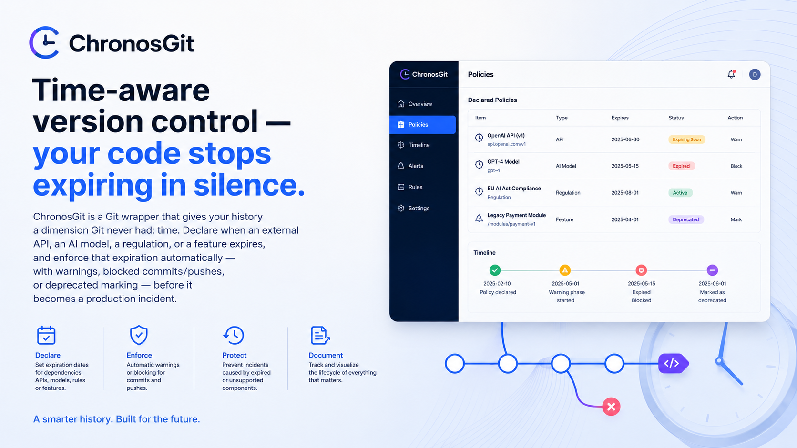

# ⏳ ChronosGit

### Time-aware version control — your code stops expiring in silence.

**ChronosGit** is a Git wrapper that gives your history a dimension Git never had: time. Declare when an external API, an AI model, a regulation, or a function stops being valid, and enforce that expiration automatically — with warnings, blocked commits/pushes, or `deprecated` marking — before it becomes a production incident.

> 🔒 This repository is the **public showcase** of ChronosGit. The full source code lives in a private repository, and access is granted automatically and instantly right after purchase.

---

## 🚀 Get Instant Access

Access to the private ChronosGit repository is unlocked **automatically** within minutes, through a webhook that connects your payment to the GitHub API.

### How it works

1. **Click the PayPal button** below to complete your purchase.
2. **Important:** the PayPal form has a **notes / special instructions for seller** field. Enter your **exact GitHub username** there (the same one you'll log in with, e.g. `octocat`) — this is **required** so the system can send you the invitation.
3. As soon as the payment is confirmed, the webhook automatically invites that GitHub account as a collaborator on the private repository.
4. Check your email or your GitHub notifications: a collaborator invitation will arrive that you need to **accept** to get access.

> ⚠️ If your GitHub username is missing or misspelled in the payment notes, the invitation can't be sent automatically and will need to be resolved manually through support — double-check it before confirming.

**Prefer to pay from your phone?** Scan the QR code:

---

## ✨ Key Features

- ⏱️ **Declarative expiration rules** — define in `.chronos/config.json` when a file, function, or external dependency stops being valid.
- 🛑 **Smart Git hooks** — `pre-commit` and `pre-push` automatically block, warn, or mark as `deprecated` based on the rule and the date.
- 📋 **Temporal commit registry** — attach a validity date to any commit (`chronos commit --valid-until`) and detect when that commitment expires.
- 🔮 **Future simulation** — `chronos simulate --target-date` tells you today what will break in your project 3, 6, or 12 months from now.
- 📊 **JSON/HTML audit reports** — ready for compliance, security reviews, or engineering dashboards.
- 🤖 **Built-in CI/CD** — GitHub Actions workflow that runs the temporal audit on every push, PR, and on a schedule.
- 💳 **Monetization ready out of the box** — serverless function (Stripe → GitHub API) to automate paid access to private repositories.
- 📦 **Standalone binaries** — packaged with PyInstaller for Windows, macOS, and Linux, no Python installation required.

---

## 🧩 Requirements / Compatibility

| Requirement | Detail |
|---|---|
| Python | 3.10 or higher |
| Git | Any recent version with standard hook support |
| Operating systems | Windows, macOS, Linux (standalone binaries available) |
| Key dependencies | `typer`, `rich`, `pydantic` v2 |
| CI/CD usage | Compatible with GitHub Actions (workflow included) |

---

## 🎬 Demo

*ChronosGit's Policies dashboard: dependencies, AI models, and regulations declared with their expiration date, status (`Expiring Soon`, `Expired`, `Active`, `Deprecated`), and the lifecycle timeline for each one.*

---

## ❓ Frequently Asked Questions (FAQ)

**How long does it take to get access after paying?**
The process is automatic: you'll typically receive the GitHub collaborator invitation within minutes of payment confirmation.

**What if I forgot to add my GitHub username to the payment notes?**
Contact us with your payment receipt and correct GitHub username, and your access will be activated manually.

**Does the invitation grant lifetime access or is it a subscription?**
Access corresponds to a collaborator invitation to the private repository under the terms stated on the purchase page.

**Can I use ChronosGit in my company's private repositories?**
Yes. Once you have access to the source code, you can integrate it into any of your own or your organization's projects.

**What exactly is included in the private repository?**
Full source code, architecture documentation, test suite, CI/CD workflows, and the deployment guide for the monetization serverless function.

**Do you offer technical support?**
Yes, through the contact channels listed on the PayPal purchase page.

---

## 💳 Ready to stop letting your code expire in silence?

Get instant access to the ChronosGit private repository right now.

*Remember to enter your GitHub username in the payment notes to receive your invitation automatically.*

## 🔗 Other projects

More tools from the same author:

- **[LocalVectorSync](https://github.com/Evangelikcaos/local-vector-sync)** — local-first, privacy-native vector search engine for Node/Tauri/Electron, with optional encrypted S3/R2 sync.
- **[VectorStock CLI](https://github.com/Evangelikcaos/vector-stock-cli)** — sanitizes SVGs and auto-generates AI metadata for Adobe Stock, Freepik, and Shutterstock uploads.
- **[ASTify](https://github.com/Evangelikcaos/AStify-app)** — AI-guided AST-based diff pruner that cuts LLM context tokens 70-80% in PR/CI code review.
- **[ArtemisMock](https://github.com/Evangelikcaos/ArtemisMock-app)** — fully local, AI-guided real-time mock API server generated from OpenAPI/Prisma schemas.
- **[VectorStock CLI](https://github.com/Evangelikcaos/vector-stock-cli)** — open-source CLI: sanitizes SVGs and auto-generates AI metadata for stock marketplace uploads.
